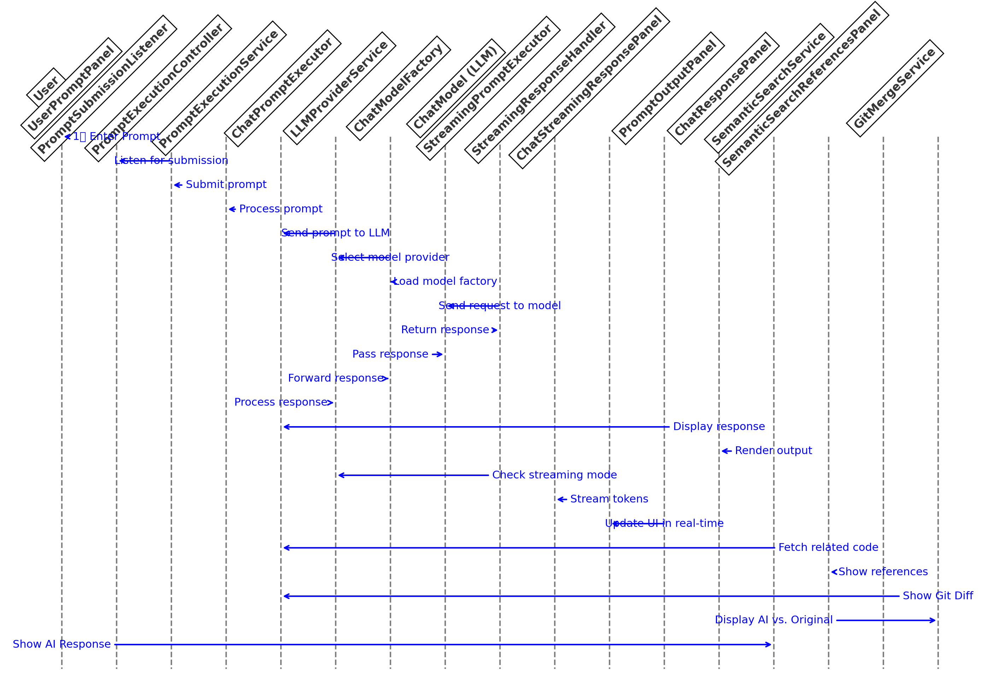

## Devoxx Genie 


[](https://x.com/devoxxgenie)


Devoxx Genie is a fully Java-based LLM Code Assistant plugin for IntelliJ IDEA, designed to integrate with local LLM providers such as [Ollama](https://ollama.com/), [LMStudio](https://lmstudio.ai/), [GPT4All](https://gpt4all.io/index.html), [Llama.cpp](https://github.com/ggerganov/llama.cpp) and [Exo](https://github.com/exo-explore/exo) but also cloud based LLM's such as [OpenAI](https://openai.com), [Anthropic](https://www.anthropic.com/), [Mistral](https://mistral.ai/), [Groq](https://groq.com/), [Gemini](https://aistudio.google.com/app/apikey), [DeepInfra](https://deepinfra.com/dash/deployments), [DeepSeek](https://www.deepseek.com/), [OpenRouter](https://www.openrouter.ai/), [Azure OpenAI](https://azure.microsoft.com/en-us/products/ai-services/openai-service) and [Amazon Bedrock](https://aws.amazon.com/bedrock)

We now also support RAG-based prompt context based on your vectorized project files. 
In addition to Git Dif viewer and LLM-driven web search with [Google](https://developers.google.com/custom-search) and [Tavily](https://tavily.com/).

With Claude 3.5 Sonnet, DevoxxGenie isn't just another developer tool... it's a glimpse into the future of software engineering. One thing is clear: we're witnessing a paradigm shift in Ai Augmented Programming (AAP) 🐒

[](https://plugins.jetbrains.com/plugin/24169-devoxxgenie)
12K+ Downloads

### Hands-on with DevoxxGenie

[](https://www.youtube.com/live/kgtctcbA6WE?feature=shared&t=124)

### More Video Tutorials:

- [DevoxxGenie in action (Devoxx Belgium 2024)](https://www.youtube.com/watch?v=c5EyVLAXaGQ)
- [How ChatMemory works](https://www.youtube.com/watch?v=NRAe4d7n6_4)
- [Hands-on with DevoxxGenie](https://youtu.be/Rs8S4rMTR9s?feature=shared)
- [The Era of AAP: Ai Augmented Programming using only Java](https://www.youtube.com/watch?v=yvgvALVs3xo)

### Blog Posts:

- [DevoxxGenie: Your AI Assistant for IDEA](https://mydeveloperplanet.com/2024/10/08/devoxxgenie-your-ai-assistant-for-idea/)
- [The Devoxx Genie IntelliJ Plugin Provides Access to Local or Cloud Based LLM Models](https://www.infoq.com/news/2024/05/devoxx-genie-intellij-plugin/)
- [10K+ Downloads Milestone for DevoxxGenie!](https://www.linkedin.com/pulse/10k-downloads-milestone-devoxxgenie-stephan-janssen-hokce/)

### Key Features:

- **📸 DnD images (🔥 NEW)**: You can now DnD images with multimodal LLM's.
- **🧐 RAG Support**: Retrieval-Augmented Generation (RAG) support for automatically incorporating project context into your prompts.
- **💪🏻 Git Diff/Merge** : Show Git Diff/Merge dialog to accept LLM suggestions.
- **👀 Chat History**: Your chats are stored locally, allowing you to easily restore them in the future.
- **🧠 Project Scanner**: Add source code (full project or by package) to prompt context when using Anthropic, OpenAI or Gemini.
- **💰 Token Cost Calculator**: Calculate the cost when using Cloud LLM providers.
- **🔍 Web Search** : Search the web for a given query using Google or Tavily.
- **🏎️ Streaming responses**: See each token as it's received from the LLM in real-time.
- **🧐 Abstract Syntax Tree (AST) context**: Automatically include parent class and class/field references in the prompt for better code analysis.
- **💬 Chat Memory Size**: Set the size of your chat memory, by default its set to a total of 10 messages (system + user & AI msgs).
- **☕️ 100% Java**: An IDEA plugin using local and cloud based LLM models. Fully developed in Java using [Langchain4J](https://github.com/langchain4j/langchain4j)
- **👀 Code Highlighting**: Supports highlighting of code blocks.
- **💬 Chat conversations**: Supports chat conversations with configurable memory size.
- **📁 Add files & code snippets to context**: You can add open files to the chat window context for producing better answers or code snippets if you want to have a super focused window

### Start in 5 Minutes with local LLM

- Download and start [Ollama](https://ollama.com/download)
- Open terminal and download a model using command "ollama run llama3.2"
- Start your IDEA and go to plugins > Marketplace and enter "Devoxx"
- Select "DevoxxGenie" and install plugin
- In the DevoxxGenie window select Ollama and available model
- Start prompting

### Start in 2 Minutes using Cloud LLM

- Start your IDEA and go to plugins > Marketplace and enter "Devoxx"
- Select "DevoxxGenie" and install plugin
- Click on DevoxxGenie cog (settings) icon and click on Cloud Provider link icon to create API KEY
- Paste API Key in Settings panel
- In the DevoxxGenie window select your cloud provider and model
- Start prompting

### 📸 "I can see" DnD images

You can now drag and drop images (and project files) directly into the input field when working with multimodal LLMs like Google Gemini, Anthropic Claude, ChatGPT 4.x, 
or even local models such as [LLaVA](https://ollama.com/library/llava)


You can even combine screenshots together with some code and then ask related questions! 🔥

### 🔥 RAG Feature 


Devoxx Genie now includes starting from v0.4.0 a Retrieval-Augmented Generation (RAG) feature, which enables advanced code search and retrieval capabilities. 
This feature uses a combination of natural language processing (NLP) and machine learning algorithms to analyze code snippets and identify relevant results based on their semantic meaning.

With RAG, you can:

* Search for code snippets using natural language queries
* Retrieve relevant code examples that match your query's intent
* Explore related concepts and ideas in the codebase

We currently use Ollama and Nomic Text embedding to generates vector representations of your project files.
These embedding vectors are then stored in a Chroma DB (v0.6.2) running locally within Docker. 
The vectors are used to compute similarity scores between search queries and your code all running locally.

The RAG feature is a significant enhancement to Devoxx Genie's code search capabilities, enabling developers to quickly find relevant code examples and accelerate their coding workflow.

See also [Demo](https://www.youtube.com/watch?v=VVU8x45jIt4)

Expecting to add also [GraphRAG](https://github.com/devoxx/DevoxxGenieIDEAPlugin/issues/474) in the near future.

### LLM Settings
In the IDEA settings you can modify the REST endpoints and the LLM parameters.  Make sure to press enter and apply to save your changes.

We now also support Cloud based LLMs, you can paste the API keys on the Settings page. 


### Smart Model Selection and Cost Estimation
The language model dropdown is not just a list anymore, it's your compass for smart model selection.


See available context window sizes for each cloud model
View associated costs upfront
Make data-driven decisions on which model to use for your project

### Add Project to prompt & clipboard

You can now add the full project to your prompt IF your selected cloud LLM has a big enough window context.


### Calc Cost

Leverage the prompt cost calculator for precise budget management. Get real-time updates on how much of the context window you're using.


See the input/output costs and window context per Cloud LLM.  Eventually we'll also allow you to edit these values.


### Handling Massive Projects?
"But wait," you might say, "my project is HUGE!" 😅 

Fear not! We've got options:

1. Leverage Gemini's Massive Context: 

Gemini's colossal 1 million token window isn't just big, it's massive. We're talking about the capacity to digest approximately 30,000 lines of code in a single go. That's enough to digest most codebases whole, from the tiniest scripts to some decent projects.

But if that's not enough you have more options...

2. Smart Filtering: 

The new "Copy Project" panel lets you: 

Exclude specific directories 
Filter by file extensions
Remove JavaDocs to slim down your context


3. Selective Inclusion 

Right-click to add only the most relevant parts of your project to the context.


## Git Diff viewer
Starting from v0.3.0, you can enable a Git diff/merge viewer to directly review and accept LLM-generated code changes without needing to copy and paste them from the LLM's response.
To activate this feature, navigate to Settings and select "LLM Git Diff Merge." You can then choose between a two-panel or three-panel Git diff view.


For example, the two-panel Git diff view works seamlessly with the local Ollama LLM provider and the Llama 3.2 3B model.

https://github.com/user-attachments/assets/817159ab-586f-4d46-bd46-bc0097805aed

## The Power of Full Context: A Real-World Example
The DevoxxGenie project itself, at about 70K tokens, fits comfortably within most high-end LLM context windows. 
This allows for incredibly nuanced interactions – we're talking advanced queries and feature requests that leave tools like GitHub Copilot scratching their virtual heads!

## Support for JLama & LLama3.java
DevoxxGenie now also supports the 100% Modern Java LLM inference engines: [JLama](https://github.com/tjake/Jlama).

JLama offers a REST API compatible with the widely-used OpenAI API. Use the Custom OpenAI URL to connect.


You can also integrate it seamlessly with [Llama3.java](https://github.com/stephanj/Llama3JavaChatCompletionService) but using the Spring Boot OpenAI API wrapper coupled with the JLama DevoxxGenie option.

## Local LLM Cluster with Exo

Use the custom OpenAI URL to connect to Exo, a local LLM cluster for Apple Silicon which allows you to run Llama 3.1 8b, 70b and 405b on your own Apple computers 🤩


## Test Driven Generation (TDG) - Experimental

Write a unit test and let DevoxxGenie generated the implementation for that unit test. 
This approach was explained by Bouke Nijhuis in his [Devoxx Belgium presentation](https://youtu.be/YRFpyGbp6h4?si=mYzJuVRMnclZJMIM)

An demo on how to accomplish this can be seen in this 𝕏 [post](https://x.com/Stephan007/status/1854949507710198209).

## DeepSeek R1 & DevoxxGenie 🔥

As of today (February 2, 2025), alongside the DeepSeek API Key, you can access the full 671B model for FREE using either [Nvidia](https://build.nvidia.com/deepseek-ai/deepseek-r1) or [Chutes](https://chutes.ai)!
Simply update the Custom OpenAI URL, Model and API Key on the Settings page as follows:


Chutes URL : https://chutes-deepseek-ai-deepseek-r1.chutes.ai/v1/

Nvidia URL : https://integrate.api.nvidia.com/v1

## Grok & DevoxxGenie

Create an account on [Grok](https://console.x.ai/) and generated an API Key.  Now open the DevoxxGenie settings and enter the OpenAI compliant URL for Grok, the model you want to use and your API Key.


### Installation:

- **From IntelliJ IDEA**: Go to `Settings` -> `Plugins` -> `Marketplace` -> Enter 'Devoxx' to find [plugin](https://plugins.jetbrains.com/plugin/24169-devoxxgenie) OR Install plugin from Disk
- **From Source Code**: Clone the repository, build the plugin using `./gradlew buildPlugin`, and install the plugin from the `build/distributions` directory and select file 'DevoxxGenie-X.Y.Z.zip'

### Requirements:

- **IntelliJ** minimum version is 2023.3.4
- **Java** minimum version is JDK 17

### Build

Gradle IntelliJ Plugin prepares a ZIP archive when running the buildPlugin task.  
You'll find it in the build/distributions/ directory

```shell
./gradlew buildPlugin 
```

### Publish plugin

It is recommended to use the publishPlugin task for releasing the plugin

```shell
./gradlew publishPlugin
```


### Usage:
1) Select an LLM provider from the DevoxxGenie panel (right corner)
2) Select some code 
4) Enter shortcode command review, explain, generate unit tests of the selected code or enter a custom prompt.

Enjoy!


## Contribute

### Understanding the Prompt Flow

The DevoxxGenie IDEA Plugin processes user prompts through the following steps:

### 1️⃣ User Inputs a Prompt
- [`UserPromptPanel`](https://github.com/devoxx/DevoxxGenieIDEAPlugin/blob/master/src/main/java/com/devoxx/genie/ui/panel/UserPromptPanel.java) → Captures the prompt from the UI.
- [`PromptSubmissionListener.onPromptSubmitted()`](https://github.com/devoxx/DevoxxGenieIDEAPlugin/blob/master/src/main/java/com/devoxx/genie/ui/listener/PromptSubmissionListener.java) → Listens for the submission event.
- [`PromptExecutionController.handlePromptSubmission()`](https://github.com/devoxx/DevoxxGenieIDEAPlugin/blob/master/src/main/java/com/devoxx/genie/controller/PromptExecutionController.java) → Starts execution.

### 2️⃣ Processing the Prompt
- [`PromptExecutionService.executeQuery()`](https://github.com/devoxx/DevoxxGenieIDEAPlugin/blob/master/src/main/java/com/devoxx/genie/service/PromptExecutionService.java) → Handles token usage calculations and checks RAG/GitDiff settings.
- [`ChatPromptExecutor.executePrompt()`](https://github.com/devoxx/DevoxxGenieIDEAPlugin/blob/master/src/main/java/com/devoxx/genie/service/ChatPromptExecutor.java) → Dispatches the prompt to the selected **LLM provider**.
- [`LLMProviderService.getAvailableModelProviders()`](https://github.com/devoxx/DevoxxGenieIDEAPlugin/blob/master/src/main/java/com/devoxx/genie/service/LLMProviderService.java) → Retrieves the appropriate model from `ChatModelFactory`.

### 3️⃣ LLM Model Inference
- [`ChatModelFactory.getModels()`](https://github.com/devoxx/DevoxxGenieIDEAPlugin/blob/master/src/main/java/com/devoxx/genie/chatmodel/ChatModelFactory.java) → Gets the models for the select LLM provider
- **Cloud-based LLMs:**
  - [`OpenAIChatModelFactory.createChatModel()`](https://github.com/devoxx/DevoxxGenieIDEAPlugin/blob/master/src/main/java/com/devoxx/genie/chatmodel/cloud/openai/OpenAIChatModelFactory.java)
  - [`AnthropicChatModelFactory.createChatModel()`](https://github.com/devoxx/DevoxxGenieIDEAPlugin/blob/master/src/main/java/com/devoxx/genie/chatmodel/cloud/anthropic/AnthropicChatModelFactory.java)
  - ...
    
- **Local models:**
  - [`OllamaChatModelFactory.createChatModel()`](https://github.com/devoxx/DevoxxGenieIDEAPlugin/blob/master/src/main/java/com/devoxx/genie/chatmodel/local/ollama/OllamaChatModelFactory.java)
  - [`GPT4AllChatModelFactory.createChatModel()`](https://github.com/devoxx/DevoxxGenieIDEAPlugin/blob/master/src/main/java/com/devoxx/genie/chatmodel/local/gpt4all/GPT4AllChatModelFactory.java)
  - ...

### 4️⃣ Response Handling
- **If streaming is enabled:**
  - [`StreamingPromptExecutor.execute()`](https://github.com/devoxx/DevoxxGenieIDEAPlugin/blob/master/src/main/java/com/devoxx/genie/service/streaming/StreamingPromptExecutor.java) → Begins token-by-token streaming.
  - [`ChatStreamingResponsePanel.createHTMLRenderer()`](https://github.com/devoxx/DevoxxGenieIDEAPlugin/blob/master/src/main/java/com/devoxx/genie/ui/panel/ChatStreamingResponsePanel.java) → Updates UI in real time.

- **If non-streaming:**
  - [`PromptExecutionService.executeQuery()`](https://github.com/devoxx/DevoxxGenieIDEAPlugin/blob/master/src/main/java/com/devoxx/genie/service/PromptExecutionService.java) → Formats the full response.
  - [`ChatResponsePanel.displayResponse()`](https://github.com/devoxx/DevoxxGenieIDEAPlugin/blob/master/src/main/java/com/devoxx/genie/ui/panel/ChatResponsePanel.java) → Renders the text and code blocks.

### 5️⃣ Enhancements (RAG & Git Diff)
#### **RAG (Retrieval-Augmented Generation)**
- **Indexing Source Code for Retrieval**
  - [`ProjectIndexerService.indexFiles()`](https://github.com/devoxx/DevoxxGenieIDEAPlugin/blob/master/src/main/java/com/devoxx/genie/service/rag/ProjectIndexerService.java) → Indexes project files
  - [`ChromaDBIndexService.storeEmbeddings()`](https://github.com/devoxx/DevoxxGenieIDEAPlugin/blob/master/src/main/java/com/devoxx/genie/service/chromadb/ChromaEmbeddingService.java) → Stores embeddings in **ChromaDB**.

- **Retrieval & Augmentation**
  - [`SemanticSearchService.search()`](https://github.com/devoxx/DevoxxGenieIDEAPlugin/blob/master/src/main/java/com/devoxx/genie/service/rag/SemanticSearchService.java) → Fetches relevant indexed code.
  - [`SemanticSearchReferencesPanel`](https://github.com/devoxx/DevoxxGenieIDEAPlugin/blob/master/src/main/java/com/devoxx/genie/ui/panel/chatresponse/SemanticSearchReferencesPanel.java) → Displays retrieved results.

- **Git Diff Integration**
  - [`GitMergeService.showDiffView()`](https://github.com/devoxx/DevoxxGenieIDEAPlugin/blob/master/src/main/java/com/devoxx/genie/service/gitdiff/GitMergeService.java) → Displays AI-generated code diffs.

### 6️⃣ Final Display
- The response is rendered in `ChatResponsePanel` with:
  - [`ResponseHeaderPanel`](https://github.com/devoxx/DevoxxGenieIDEAPlugin/blob/master/src/main/java/com/devoxx/genie/ui/panel/chatresponse/ResponseHeaderPanel.java) → Shows metadata (LLM name, execution time).
  - [`ResponseDocumentPanel`](https://github.com/devoxx/DevoxxGenieIDEAPlugin/blob/master/src/main/java/com/devoxx/genie/ui/panel/chatresponse/ResponseDocumentPanel.java) → Formats text & code snippets.
  - [`MetricExecutionInfoPanel`](https://github.com/devoxx/DevoxxGenieIDEAPlugin/blob/master/src/main/java/com/devoxx/genie/ui/panel/chatresponse/MetricExecutionInfoPanel.java) → Displays token usage and cost.

### Understanding the Flow

Below is a **detailed flow diagram** illustrating this workflow:



---

### How to Get Started

- Start by **exploring [`PromptExecutionController.java`](https://github.com/devoxx/DevoxxGenieIDEAPlugin/blob/master/src/main/java/com/devoxx/genie/controller/PromptExecutionController.java)** to see how prompts are routed.
- Modify [`ChatResponsePanel.java`](https://github.com/devoxx/DevoxxGenieIDEAPlugin/blob/master/src/main/java/com/devoxx/genie/ui/panel/ChatResponsePanel.java) if you want to **enhance response rendering**.
- To **add a new LLM provider**, create a factory under [`chatmodel/cloud/`](https://github.com/devoxx/DevoxxGenieIDEAPlugin/blob/master/src/main/java/com/devoxx/genie/chatmodel/cloud/) or [`chatmodel/local/`](https://github.com/devoxx/DevoxxGenieIDEAPlugin/blob/master/src/main/java/com/devoxx/genie/chatmodel/local/).

Want to contribute? **Submit a PR!** 🚀
