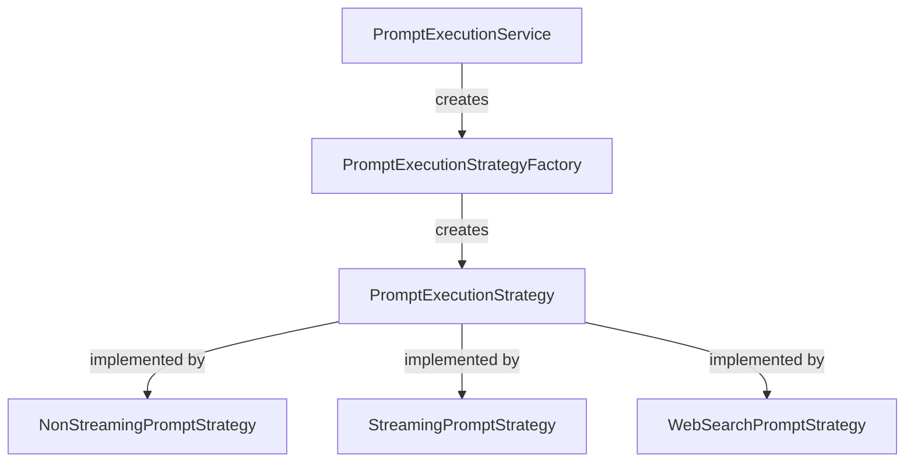
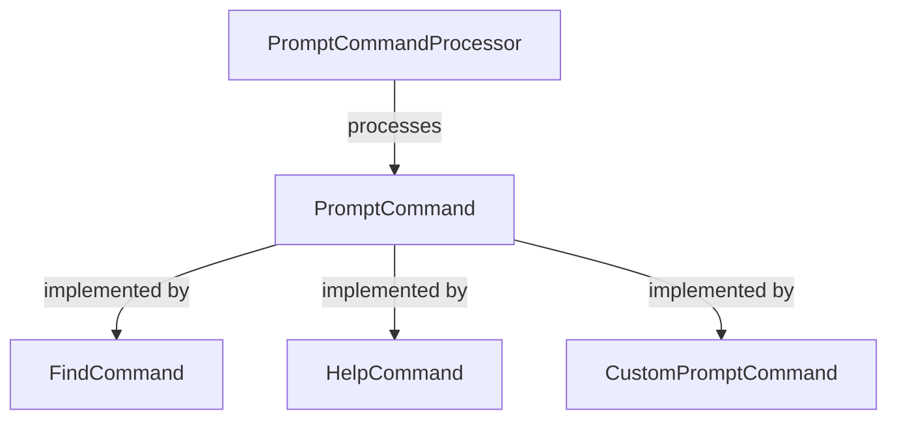

# Prompt Structure Architecture

This document describes the architecture of the prompt handling system in DevoxxGenie, which has been refactored to improve maintainability and extensibility.

## Overview

The prompt structure in DevoxxGenie uses several design patterns to create a clean, modular system:

1. **Strategy Pattern**: Different execution approaches for different types of prompts
2. **Command Pattern**: Handling specific prompt commands
3. **Factory Pattern**: Creating appropriate strategies based on context
4. **Service-oriented Architecture**: Centralized services for key functionalities

## Core Components

### Controllers

- **PromptExecutionController**: Main controller that orchestrates prompt execution
- **TokenCalculationController**: Handles token calculation and cost estimation
- **ProjectContextController**: Manages project context for prompts

### Services

- **PromptExecutionService**: Orchestrates prompt execution workflow
- **ChatMemoryManager**: Unified memory management for conversations
- **PromptCommandProcessor**: Central command processing for slash commands
- **ChatPromptExecutor**: Handles direct interaction with LLM providers

### Strategy Components

The strategy pattern is used to handle different types of prompt execution:

- **PromptExecutionStrategy** (interface): Common interface for all strategies
- **NonStreamingPromptStrategy**: Handles regular, non-streaming responses
- **StreamingPromptStrategy**: Manages token-by-token streaming responses
- **WebSearchPromptStrategy**: Incorporates web search results into responses

### Command Components

The command pattern handles different types of slash commands:

- **PromptCommand** (interface): Common interface for all commands
- **FindCommand**: Handles /find commands (particularly for RAG search)
- **HelpCommand**: Handles /help commands for documentation
- **CustomPromptCommand**: Handles user-defined custom commands

## Prompt Flow

The following diagram illustrates the complete prompt flow in DevoxxGenie:

The prompt flows through these steps:

1. **User Input**: Captured in `UserPromptPanel`
2. **Event Handling**: `PromptSubmissionListener` and `PromptExecutionController` process the event
3. **Command Processing**: `PromptCommandProcessor` checks for and handles slash commands
4. **Strategy Selection**: `PromptExecutionStrategyFactory` creates the appropriate execution strategy
5. **Context Preparation**: Includes project files, RAG context, etc.
6. **LLM Provider**: The query is passed to the selected LLM provider
7. **Response Handling**: The response is processed and displayed to the user

## Memory Management

Chat memory is managed through the `ChatMemoryManager` service:

- Maintains a configurable-sized window of previous messages
- Handles system messages, user messages, and AI responses
- Provides context for the LLM to maintain conversation coherence

## Token Management

Token calculation and cost estimation are handled by:

- **TokenCalculationController**: Coordinates token-related operations
- **TokenCalculationService**: Performs actual calculations based on the selected model
- **TokenUsageBar**: UI component to visualize token usage

## Error Handling

The system includes centralized error handling through:

- **PromptErrorHandler**: Central error-handling component
- **Different exception types**: ModelException, MemoryException, PromptException, etc.
- **UI feedback**: Proper error messaging to the user

## Extending the System

### Adding a New Strategy

To add a new prompt execution strategy:

1. Create a new class implementing `PromptExecutionStrategy`
2. Add logic to `PromptExecutionStrategyFactory` to select your strategy
3. Register any required services in the dependency injection system

### Adding a New Command

To add a new slash command:

1. Create a new class implementing `PromptCommand`
2. Add handling in `PromptCommandProcessor` to recognize your command
3. Register the command processor if needed

### Adding Provider-Specific Features

To add features for specific LLM providers:

1. Extend the appropriate provider factory (e.g., `OpenAIChatModelFactory`)
2. Add provider-specific parameters or capabilities
3. Update the UI to expose the new features when the provider is selected

## Best Practices

When working with the prompt structure:

1. **Follow Established Patterns**: Use the existing strategy and command patterns
2. **Maintain Separation of Concerns**: Keep UI, business logic, and provider communication separate
3. **Use Dependency Injection**: Leverage IntelliJ's service framework for dependencies
4. **Handle Errors Gracefully**: Use the error handling framework
5. **Write Tests**: New components should have corresponding unit tests

## Future Directions

The prompt structure architecture is designed to evolve with:

1. Support for more complex agentic behaviors
2. Enhanced RAG and knowledge graph integrations
3. Multi-stage reasoning and planning capabilities
4. More sophisticated memory management
