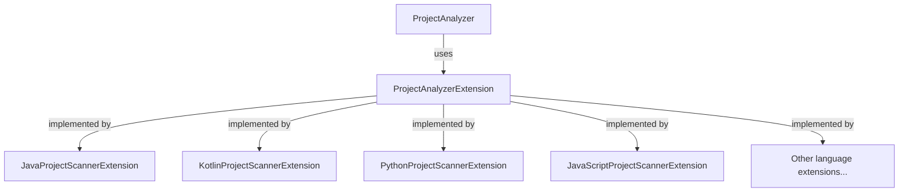

# Project Scanner

The Project Scanner feature in DevoxxGenie allows you to add your project source code to the prompt context, enabling the LLM to provide more relevant and project-specific responses.

## Overview

The Project Scanner:

1. Analyzes your project structure
2. Extracts code from files based on your selection
3. Adds this code to the prompt context
4. Allows the LLM to understand your project's architecture and patterns

This feature is particularly valuable for:
- Getting suggestions that align with your existing code style
- Asking questions about your project architecture
- Generating code that integrates well with your codebase

## Using Project Scanner

### Adding Project Files to Context

#### Add Entire Project

To add your entire project to the prompt context:

1. Click the "Add Project" button in the DevoxxGenie toolbar
2. DevoxxGenie will scan your project and add relevant files to the context
3. A token count and file count will be displayed

#### Add Specific Directory

To add a specific directory:

1. Right-click on a directory in the project view
2. Select "Add Directory to Prompt Context"
3. The directory contents will be added to the context

#### Add Individual Files

To add individual files:

1. Right-click on a file in the project view
2. Select "Add File(s) To Prompt Context"
3. Or drag and drop files from the project view into the DevoxxGenie window

### Viewing Added Files

The DevoxxGenie interface shows files that have been added to the context:

1. Each file is listed with its path in the "Context Files" panel
2. A token usage bar shows how much of the available context window is being used
3. You can remove files by clicking the "x" next to their names

## Configuring Project Scanner

To configure how Project Scanner works:

1. Open DevoxxGenie settings
2. Navigate to "Scan & Copy Project"
3. Configure your preferences

### Configuration Options

#### Include/Exclude Patterns

- **Include Extensions**: Specify which file extensions to include (e.g., java, kt, xml)
- **Exclude Directories**: Specify directories to exclude (e.g., build, target, .git)
- **Use .gitignore**: Automatically exclude files listed in your .gitignore

#### Content Filtering

- **Remove JavaDocs**: Option to strip JavaDoc comments to reduce token count
- **Max File Size**: Set a limit for file sizes to include
- **Line Limit**: Set a maximum number of lines per file

#### Project-Wide Settings

- **Scan Depth**: Set how deep in the directory tree to scan
- **File Limit**: Set a maximum number of files to include
- **Token Limit**: Set a maximum token count for the entire context

## Token Management

Project Scanner includes token management features:

### Token Calculation

To calculate tokens for a directory:

1. Right-click on a directory in the project view
2. Select "Calc Tokens for Directory"
3. View token count, estimated cost, and compatible models

### Context Window Management

The interface shows:

1. Current token usage versus context window size
2. Warning if you approach the context window limit
3. Recommendations for larger context window models if needed

### Smart Model Selection

When using "Add Project":

1. The total token count is calculated
2. Only models that can handle the token count are enabled
3. Cost estimation is provided for cloud models

## Language-Specific Features

Project Scanner has special handling for different programming languages:

### Java Support

- AST (Abstract Syntax Tree) context for Java files
- Special handling for Java packages and imports
- Recognition of Java design patterns

### Other Language Support

Support for other languages includes:

- Kotlin
- Python
- JavaScript/TypeScript
- PHP
- Go
- Rust
- C/C++

Each language has specific extensions that recognize its file patterns and structure.

## Best Practices

### Optimizing Context

For the best results with Project Scanner:

1. **Be selective**: Include only relevant parts of your project
2. **Focus on core files**: Prioritize models, services, and interfaces
3. **Exclude generated code**: Generated code adds tokens without adding value
4. **Remove test files**: Unless you're specifically asking about tests
5. **Balance size and completeness**: Include enough for context but not so much it dilutes focus

### When to Use Project Scanner

Project Scanner is most useful when:

1. Asking about project-specific architecture or patterns
2. Generating code that needs to integrate with existing code
3. Refactoring that requires understanding of dependencies
4. Asking for improvements that match your code style

It may be less useful for:

1. General programming questions not related to your project
2. Very simple code generation tasks
3. When working with very large projects that exceed context limits

## Advanced Features

### Language Support Extensions

DevoxxGenie uses language-specific extensions to better understand your code:

These extensions provide language-aware scanning to:

1. Identify important structural elements
2. Recognize language-specific patterns
3. Filter out less relevant code

### DEVOXXGENIE.md Integration

Project Scanner works with DEVOXXGENIE.md:

1. The DEVOXXGENIE.md file provides high-level project information
2. Project Scanner adds specific code details
3. Together they give the LLM both the "big picture" and specific implementations

## Troubleshooting

### Common Issues

#### Token Limit Exceeded

If you exceed the token limit:

1. Be more selective about which directories to include
2. Configure Project Scanner to exclude more files
3. Use a model with a larger context window
4. Consider using RAG instead for very large projects

#### Slow Performance

If scanning is slow:

1. Exclude more directories
2. Set a lower file size limit
3. Reduce scan depth
4. Use more specific inclusion patterns

#### Irrelevant Code Included

If irrelevant code is being included:

1. Review your include/exclude patterns
2. Configure language-specific exclusions
3. Manually select directories instead of scanning the whole project
4. Use the "Remove JavaDocs" option to reduce noise

## Future Enhancements

The DevoxxGenie team is working on several enhancements to Project Scanner:

1. **Smarter code selection**: Automatically identify the most relevant files for a given query
2. **Dependency awareness**: Better understanding of dependencies between files
3. **Structure summarization**: Include summaries instead of full code for some files
4. **Integration with RAG**: Combined approach using both scanning and retrieval
